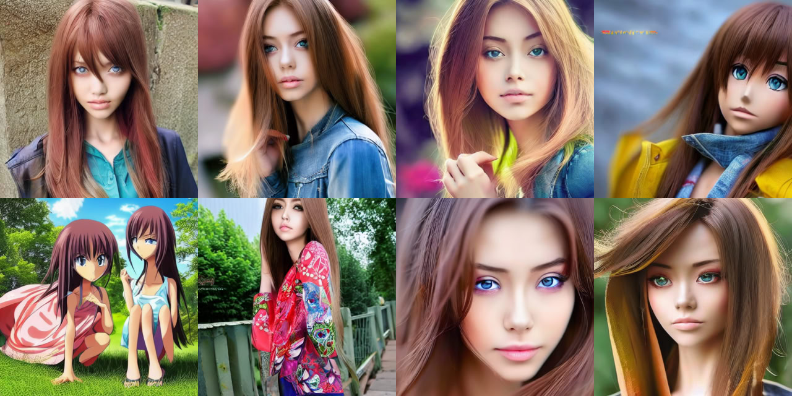

## Чекпоинт 3. Описание построения бейзлайна

### Выбор модели

В качестве бейзлайна мы решили реализовать IP-Adapter. IP-Adapter - это метод файнтюнинга диффузионных генеративных моделей, 
предложенный в статье [IP-Adapter: Text Compatible Image Prompt Adapter for
Text-to-Image Diffusion Models](https://arxiv.org/pdf/2308.06721). Суть данного метода заключается в добавлении в предобученную модель специальных Decoupled Cross-Attention слоев-адаптеров, которые помогают эффективно добавлять признаки изображения-промпта в процесс диффузии.

Мы выбрали IP-Adapter в качестве бейзлайна, так как он уже показал свою эффективность с различными моделями, позволяя успешно переносить лица и детали на генерируемые изображения. При этом он достаточно прост в реализации и имеет очень небольшие размеры (Около 20М параметров), что ускоряет обучение.

### Реализация, обучение и эксперименты

В качестве основы для реализации IP-адаптера мы взяли оригинальный код от авторов метода: [IP-Adapter](https://github.com/tencent-ailab/IP-Adapter/tree/main). Мы внесли в код значительные изменения и адаптировали его под нашу задачу и датасет.

Мы обучали IP-Adapter на нашем датасете в течение 100 эпох с гиперпараметрами по умолчанию, предложенными авторами статьи. В качестве основной диффузионной модели мы взяли самую простую из предложенных авторами модель Satble Diffusion v1.5 ([Ссылка на модель с Hugging Face](https://huggingface.co/stable-diffusion-v1-5/stable-diffusion-v1-5))

Обучение практически сразу дало неплохой результат. Эксперименты заключались в основном в подборе лучшей базовой модели, image-encoder модели и подходящего разрешения изображений.

На полученные в процессе экспериментов графики и изображения можно посмотреть в [нашем проекте wandb](https://wandb.ai/mishac22/IP-Adapter-HSE?nw=nwusermishac22).

Сам наилучший чекпоинт расположен по [этой ссылке](https://drive.google.com/file/d/1SA1cVESdbZEGFvqcPYHrzUV6lt5GGhJK/view?usp=sharing)

Проблема, с котрой мы столкнулись, заключалась в том, что хотя полученный адаптер уже неплохо захватывал черты лица с картинки, самой модели не очень хорошо удавалось применить к этому лицу аниме стиль:

Решением стало полезное свойство IP-Adaptera - его можно применять к разным моделям одной архитектуры, а не только к той, на которой он был обучен.

Мы решили этим воспользоваться и применить наш адаптер к специально обученной под аниме модели [dreamlike-anime-1.0](https://huggingface.co/dreamlike-art/dreamlike-anime-1.0).

Результат оказался уже гораздо лучше:

Пример запуска скрипта обучения, работы с моделью и больше примеров генераций можно найти в файле ip_adapter_demo.ipynb

### Метрики

При выборе метрик для оценки нашей модели мы столкнулись с определенными сложностями. До сих пор не существует популярной и общепринятой метрики для качественной оценки сходства лиц на изображении, тем более, если эти изображения в разных стилях (фотореализм vs аниме). При оценке таких моделей в релевантных статьях как правило больший упор идет на простое визуальное сравнение результатов. Тем не менее, некоторые метрики авторами все-таки предложены.

В оригинальной статье про IP-Adapter авторы используют метрики CLIP-I и CLIP-T.

- CLIP-I - это cosine similarity между эмбеддингами картинки-промпта и сгенерированного промпта. 
- CLIP-T - это CLIP-score между сгенерированной картинкой и текстом-описанием картинки-промпта

Мы реализовали и посчитали эти метрики при помощи torchmetrics.

Дополнительно мы решили посчитать FID ([Frechet Inception Distance](https://torchmetrics.readthedocs.io/en/v1.2.0/image/frechet_inception_distance.html)) между сгенерированными картинками и изображениями из [Anime Face Dataset](https://www.kaggle.com/datasets/splcher/animefacedataset), чтобы проверить, насколько получившиеся картинки попадают в доман аниме. Тут также следует отметить, что FID - это очень специфическая метрика, значение которой зависит от множества факторов, и в данном случае она также не является стопроцентным показателем качества.

Скрипт для подсчета метрик можно найти в файле ip_adapter_metrics.ipynb

Текущие значения метрик:

FID: 145.1024169921875
CLIP-T Score: 22.548322677612305
CLIP-I Score: 98.7083969116211

CLIP-I Score кажется довольно хорошим, что в целом ожидаемо от ip-адаптера. Две другие метрики оставляют желать лучшего.