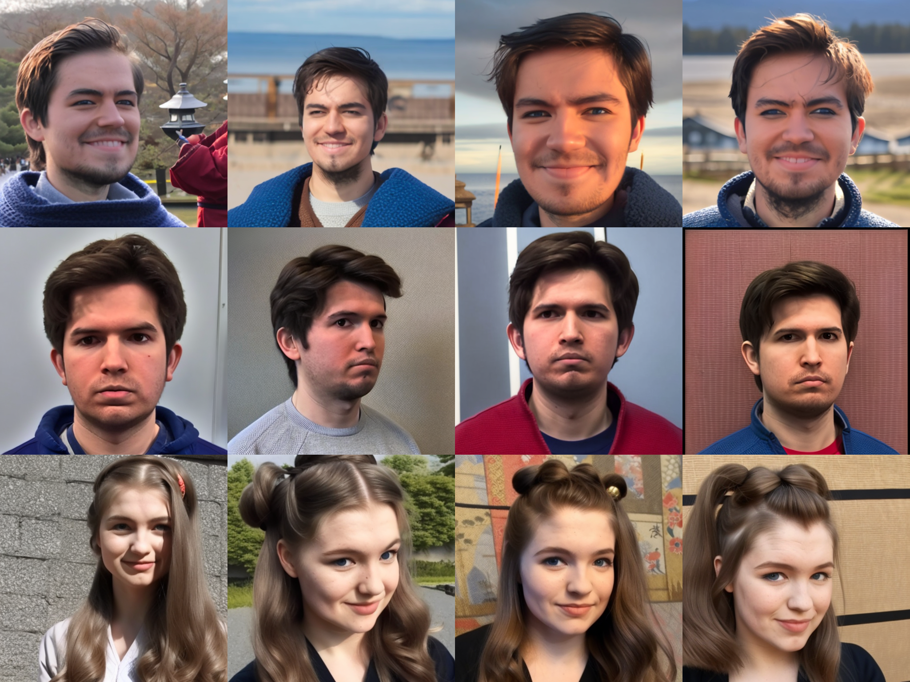
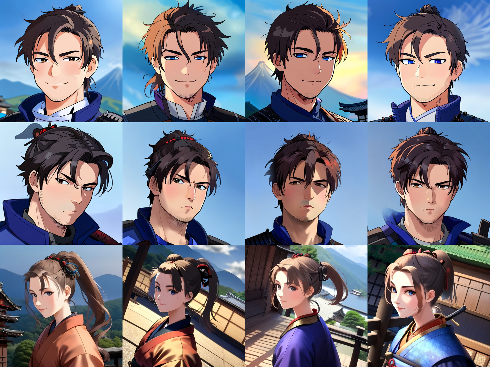
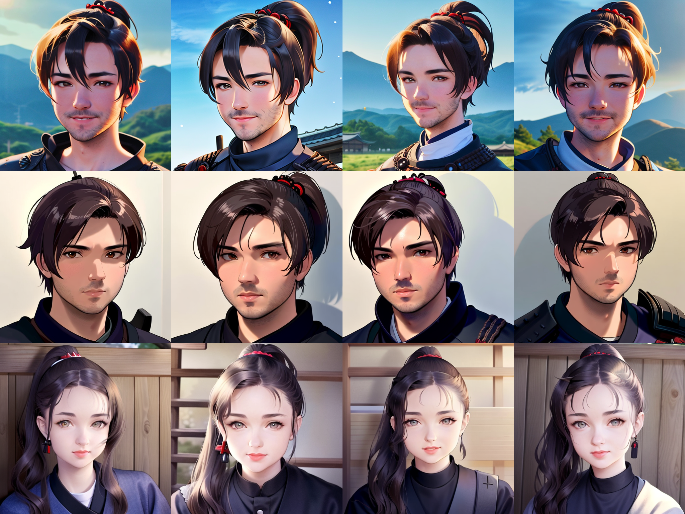

# Сравнение моделей, полученных в ходе работы над проектом

| Модель | FID               | CLIP-T Score      | CLIP-I Score      | SSIM              | MS-SSIM           |
|--------|-------------------|-------------------|-------------------|-------------------|-------------------|
| **IP-Adapter + базовая модель SD v1.5**      | 205.017 | 22.618| **99.318** | **0.408**| **0.354**|
| **IP-Adapter + аниме версия модели SD v1.5**      | 145.102 | 22.548| 98.708  | 0.349| 0.242 |
| **IP-Adapter Plus + аниме версия модели SD v1.5**      | **132.700**| **22.644**  | 98.732 | 0.366| 0.279 |

Видим, что финальная модель показала наилучшее значение FID, что говорит о том, что она лучше предыдущих моделей попадает в домен аниме. Также она показала наилучшую метрику с точки зрения следования промпту, хотя у всех трех моделей ее значения довольно близки. Можно заметить, что модели с основой, дообученной под аниме, показали немного худшие значения SSIM и MS-SSIM, что скорее всего связано с переходом из реалистичного домена в домен аниме, однако джанное падение не является критическим и другие преимущества новых моделей его перевешивают. 

## Визуальная оценка

Визуальная оценка является, пожалуй, наиболее важной метрикой в нашей задаче. От моделей ожидается, что они будут хорошо передавать лицо с загруженной картинки, а также будут учитывать текстовый промпт и все это в аниме-стиле. Ниже преведено сравнение генераций для трех наших моделей.

**Картинки-промпты для этого запроса:**

**Текстовый промпт:** samurai in medieval japan, samurai ponytail hairstyle, 2D anime style

Этот промпт хорошо сочетается с аниме-эстетикой и требует от модели не только передать лицо и перенести его в аниме-стиль, но и поменять внешность человека (прическу) и общий сеттинг.

### IP-Adapter + базовая модель SD v1.5:

Видим, что данная модель захватывает базовые черты лица, но общая узнаваемость достаточно низкая. Промп и аниме-стиль практически игнорируются.

### IP-Adapter + аниме версия модели SD v1.5:

Данная модель уже гораздо лучше передает аниме-стиль и промпт, сохраняя при этом общие черты лица. Тем не менее, качество передачи лиц все еще не очень хорошее.

### IP-Adapter Plus + аниме версия модели SD v1.5:

В этой версии лица переданы уже намного лучше, при этом достоинства прошлой версии сохраняются.