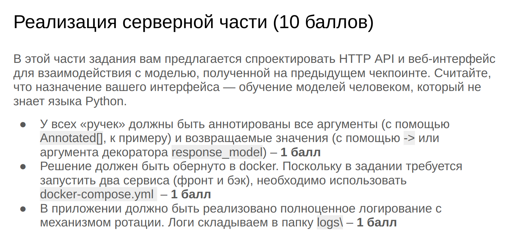
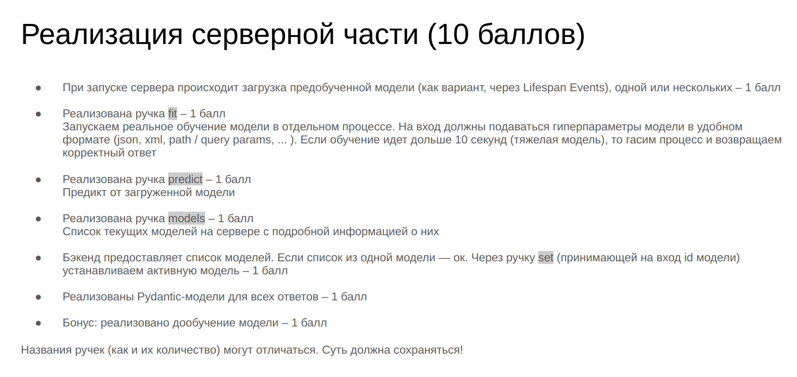
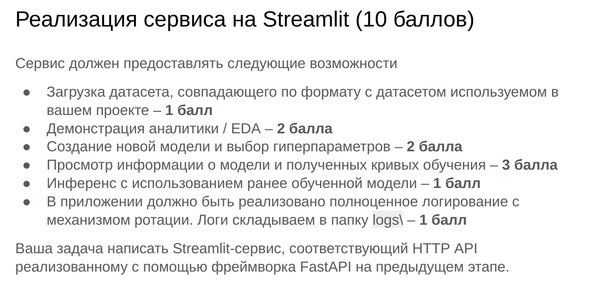

# Команда 73. Чекпоинт 4. Отчет для Code Review.

## Тема проекта: Personalized Anime Character Generation

**Кто не хочет себе аниме-девочку (или мальчика) со своим лицом? Хотим обучить модель, которая бы по текстовому описанию/картинке человека выдавала бы аниме-версию.**

Главная задача — разработать модель, которая будет генерировать аниме-версию переданного изображения с дополнительно опорой на текстовый промпт.

### Куратор: 

- Неудачина Ева (tg: [@cocosinca](https://t.me/cocosinca))

### Команда:

- Гончаров Антон Дмитриевич (tg: [@GonHunch](https://t.me/GonHunch))
- Чайчук Михаил Викторович (tg: [@chaychuk_mikhail](https://t.me/

### Текущее состояние проекта:

В качестве данных испольтзуется датасет лиц знаменитостей [Multi-Modal-CelebA-HQ](https://github.com/IIGROUP/MM-CelebA-HQ-Dataset). Подробнее про него в файле [dataset.md](./dataset.md)

На данный момент в качестве модели-бейзлайна реализован [IP-Adapter](https://arxiv.org/pdf/2308.06721). Подробнее про построение бейзлайна в файле [baseline.md](./baseline.md).

## Структура проекта

Общее описание наиболее важных файлов в проекте:

- 📁 Папка [/fastapi_app](./fastapi_app/) — код для FastAPI-приложения.
    - 📄 [main.py](./fastapi_app/main.py) — основной файл для запуска приложения
    - 📄 [pydantic_models/models.py](./fastapi_app/pydantic_models/models.py) — файл с Pydantic-моделями
    - 📄 [api/v1/api_route.py](./fastapi_app/api/v1/api_route.py) — файл с основным кодом fastapi
    - 📁 [ip_adapter/](./fastapi_app/ip_adapter/) — код для ip-adapter на основе [оригинального кода от его разработчиков](https://github.com/tencent-ailab/IP-Adapter/tree/main). Этот код дублирует код ip-adapter из src так как fastapi — независимое приложение + из-за особенностей импортов в Python.
    - 🐳 [Dockerfile](./fastapi_app/Dockerfile) — Dockerfile для fastapi
    - 📄 [openapi.yaml](./fastapi_app/openapi.yaml) — файл со схемой API

- 📁 Папка [/streamlit_app](./streamlit_app/) — код для streamlit-приложения.
    - 📄 [main.py](./streamlit_app/main.py) — основной файл приложения
    - 📄 [api_requests.py](./streamlit_app/api_requests.py) — файл с функциями для запросов к api.
    - 📄 [utils.py](./streamlit_app/utils.py) — некоторые полезные функции для основного кода
    - 🐳 [Dockerfile](./streamlit_app/Dockerfile) — Dockerfile для streamlit

- 📁 Папка [/data_analysis](./data_analysis/):
    - 📄 [create_celeba_blip_captions.py](./data_analysis/create_celeba_blip_captions.py) и [create_caption.py](./data_analysis/create_caption.py) — скрипты для создания описаний к изображениям из датасета. Подробнее в [EDA.md](./EDA.md).
    - 📒 [EDA_images.ipynb](./data_analysis/EDA_images.ipynb) и [EDA_texts.ipynb](./data_analysis/EDA_text.ipynb) — ноутбуки с EDA.

- 📁 Папка [/src](./src/) — основной код для обучения ip-адаптера и подсчета метрик.
    - 📁 [ip_adapter/](./src/ip_adapter/) — код для ip-adapter на основе [оригинального кода от его разработчиков](https://github.com/tencent-ailab/IP-Adapter/tree/main). Тот же, что и в fastapi.
    - 📄 [train_ip_adapter.py](./src/train_ip_adapter.py) — основной скрипт для обучения ip-адаптера.
    - 📄 [dataset.py](./src/dataset.py) — файл с кодом кастомного датасета для обучения.
    - 📄 [clip_image_score.py](./src/clip_image_score.py) — файл с собственной реализации метрики для torchmetrics
    - 📄 [launch.sh](./src/launch.sh) — bash скрипт для запуска обучения 

- 📄 Файл [README.md](README.md) — общее описание проекта
- 📄 Файл [checkpoints.md](./checkpoints.md) — описание пройденных этапов работы над годовым проектом.
- 📄 Файл [baseline.md](./baseline.md) — описание процесса построения бейзлайна (IP-Adapter).
- 📄 Файл [dataset.md](./dataset.md) — информация об используемых данных.
- 📄 Файл [EDA.md](./EDA.md) — общее описание проведенного EDA.

- 📒 [ip_adapter_demo.ipynb](./ip_adapter_demo.ipynb) и [ip_adapter_metrics.ipynb](ip_adapter_metrics.ipynb) — ноутбуки с демонстрацией работы ip-adaptera и подсчетом метрик.
- 🐳 [docker-compose.yaml](./docker-compose.yml) — Основной файл для сборки Docker


## Запуск обучения

1. Создать виртуальную среду и установить зависимости из [requirements.txt](./requirements.txt)
2. В папку /models положить image_encoder по [ссылке](https://drive.google.com/file/d/1b2Oux8DoZFir5AuQ2FVKeMIfLl3XXLps/view?usp=sharing)
3. В папку /checkpoints положить чекпоинт 512_res_model_checkpoint_100/ip_adapter.bin доступный по [ссылке](https://drive.google.com/file/d/1SA1cVESdbZEGFvqcPYHrzUV6lt5GGhJK/view?usp=sharing).
4. Скачать [датасет](https://disk.yandex.ru/d/QQFxCLQynOE_pg).
5. Настроить гиперпараметры и запустить обучение при помощи [launch.sh](./src/launch.sh)


## Сборка Docker и запуск приложений

1. ```git clone git@github.com:HSE-AI-Master-s-Team73-1st-Year-Project/Team73-Annual-Project```
2. ```cd path/to/clone/Team73-Annual-Project```
3. В папку /models положить image_encoder по [ссылке](https://drive.google.com/file/d/1b2Oux8DoZFir5AuQ2FVKeMIfLl3XXLps/view?usp=sharing)
4. В папку /checkpoints положить чекпоинт 512_res_model_checkpoint_100/ip_adapter.bin доступный по [ссылке](https://drive.google.com/file/d/1SA1cVESdbZEGFvqcPYHrzUV6lt5GGhJK/view?usp=sharing).
5. ```docker-compose up -d --build```
4. Приложение откроется по адресу "http://localhost:8501" в браузере
5. По окончании работы ```docker-compose down```

## Четвертый чекпоинт

### Реализация серверной части. FastAPI.

**Важно!** В виду особенностей нашего проекта после обсуждения с куратором **было принято решение немного изменить ТЗ**.

Оригинальное задание выглядело следующим образом:





Поскольку в нашем проекте происходит обучение полноценной нейронной сети, которое занимает очень много времени, **мы решили отказаться от части с обучением и дообучением модели и вместо этого сосредоточиться на инференсе** (который в нашем случае по времени занимает примерно столько же, чколько обучение стандартной ML модели). 

Мы решили, что реализуем следующий функционал:

1. Возможность генерировать изображения при помощи IP-адаптера, загрузив одно или несколько изображений-промптов, а также по желанию добавив дополнительные текстовые промпты и настроив другие параметры генеарции.
2. Возможность загрузить в систему дополнительные чекпоинты ip-адаптера и переключаться между ними.
3. Возможность выбрать между несколькими версиями основной модели для генерации. 

По итогу для fastapi были реализованы следующие ручки (более детально и в более приятном виде можно посмотреть в [openapi.yaml](./fastapi_app/openapi.yaml)):

- POST **generate_images** (аналог fit и predict из оригинального ТЗ) — основная функция для генерации изображений. Принимает список картинок-промптов, текстовые положительные и негативные промпты (опционально), другие параметры для генерации. Возвращает список сгенерированных моделью с IP-адаптером изображений.
- POST **change_model** (аналог set из оригинального ТЗ) — Изменение версии модели для генерации. Сейчас в системе доступны две модели — [стандартная версия StableDiffusion-v1-5](https://huggingface.co/stable-diffusion-v1-5/stable-diffusion-v1-5) и [аниме-версия StableDiffusion-v1-5](https://huggingface.co/dreamlike-art/dreamlike-anime-1.0), которая гораздо лучше справляется с генерацией именно аниме-картинок. Пользователь присылает id модели, на которую хочет переключиться и новая версия загружается в пайплайн.
- POST **change_adapter** (еще один аналог set из оригинального ТЗ) — Изменение чекпоинта IP-адаптера, который сейчас загружен в пайплайн. У пользователя есть возможность загрузить свои дополнительные чекпоинты и протестировать их. Принимает id чекпоинта из доступных и меняет адаптер в пайплайне.
- POST **load_new_adapter_checkpoint** (тоже своего рода аналог fit) — Загрузка нового чекпоинта IP-адаптера. Пользователь присылает новый .bin файл, id и краткое описание нового адаптера (опционально), после чего данный чекпоинт становится доступен для инференса.
- GET **get_available_adapter_checkpoints** (аналог models из оригинального ТЗ) — Возвращает список доступных для инференса адаптеров.
- GET **get_available_model_types** (тоже аналог models) — возвращает список доступных вариаций основной модели (на данный момент их две — anime и standard)
- GET **get_current_model_type** — возвращает текущую версию основной модели (standard или anime) 
- DELETE **remove** — принимает id чекпоинта и удаляет его. Предзагруженные чекпоинты (дефолтный) удалить нельзя.
- DELETE **remove_all** — удаляет все загруженные пользователем чекпоинты.

При старте приложения аниме-версия StableDiffusion и дефолтный чекпоинт загружаются в память для инференса, после чего могут меняться.

В приложении реализована асинхронная система логирования с ротацией. Приложение обернуто в докер, а также может быть установлено как модуль.

**Внимание!** Для корректной работы приложения необходимо достаточное количество оперативной памяти, а также желателен доступ к GPU.

### Реализация сервиса на Streamlit.

Как и в случае с серверной частью, **мы изменили ТЗ** после одобрения куратора.

Оригинал ТЗ:



В остутствие возможности обучения нет смысла загружать датасет для EDA (да и в нашем случае EDA не так важно и информативно).

Наше приложение, следуя логике fastapi, позволяет пользователю загрузить свои изображения, выбрать промпты и параметры генерации, и получить в результате сгенерированные изображения. 

Также пользователь может загрузить для инференса свои чекпоинты и поменять тип модели для генеарции. 

В приложении также реализовано полноценное логирование с ротацией и обертка в докер-контейнер.

Ниже можно увидеть внешний вид и весь функционал приложения в формате gif:

